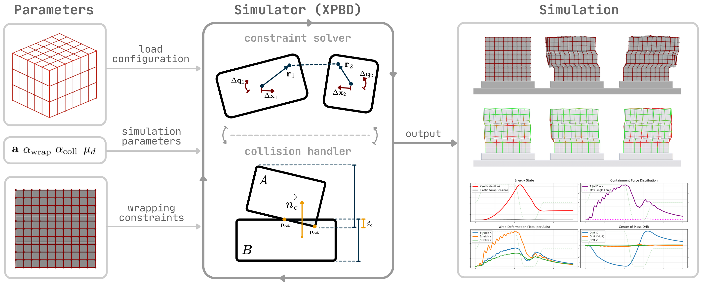
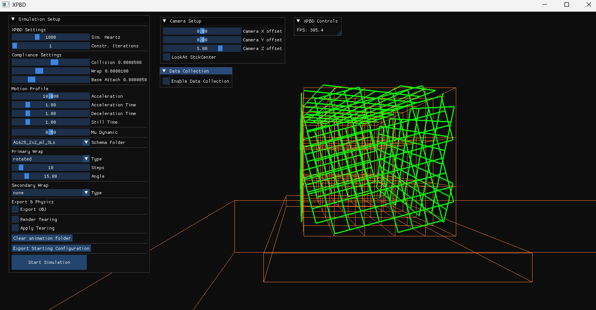
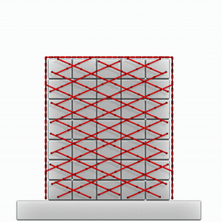
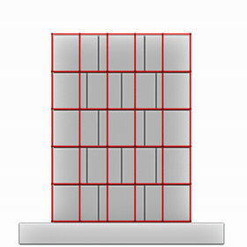
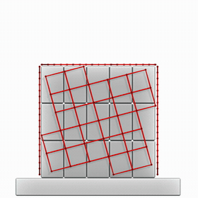
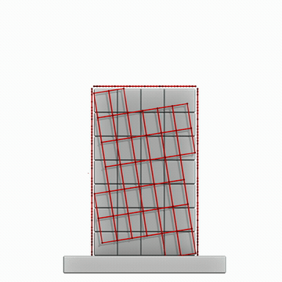
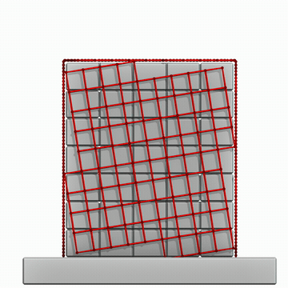

# XPBD Pallet

A real-time **XPBD** (Extended Position-Based Dynamics) simulator for **stretch-wrapped palletized loads**.
It loads a real palletizing schema (box layout, dimensions and weights), rebuilds the stack as rigid boxes,
wraps it with stretch film modelled as spring constraints, and subjects it to a transport motion profile
(acceleration → deceleration → still) to study how the load deforms, tilts and holds together.

Typical use: comparing wrapping patterns and film stiffness, and exporting displacement / tilt / force /
energy data for analysis.



## How it works

- **Boxes** → each secondary package is a rigid body (`RigidBox`) reconstructed from the schema's XML files.
- **Stretch film** → modelled as a network of spring constraints connecting boxes, generated according to a
  *wrap pattern* (grid, rotated, shifted, random, edges, …).
- **Pallet base** → bottom boxes are pinned to the pallet via base-attach constraints.
- **Motion** → a motion profile applies horizontal acceleration/deceleration to the pallet, while friction
  (`Mu Dynamic`) and box–box collisions (SAT) govern the response.
- **Solver** → constraints are projected each substep; *compliance* values set how soft each constraint is
  (higher compliance = softer/stretchier).

## Setup interface

When the program starts it opens the simulation setup screen. Configure everything here, then press
**Start Simulation**.



| Group | What it controls |
|-------|------------------|
| **XPBD Settings** | `Sim. Hertz` – solver substeps per second · `Constr. Iterations` – constraint iterations per substep |
| **Compliance** | Softness of `Collision`, `Wrap` (film) and `Base Attach` constraints |
| **Motion Profile** | `Acceleration` and the `Acceleration / Deceleration / Still` durations of the transport phase · `Mu Dynamic` – friction |
| **Schema Folder** | The palletizing schema to load (from `palleting_data/`) |
| **Primary / Secondary Wrap** | Wrap `Type`, number of `Steps`, and the pattern parameter (`Angle`, `Offset`, `Length`…) |
| **Export & Physics** | `Export OBJ` animation frames · `Render / Apply Tearing` (film breaks past a stretch limit) |
| **Camera Setup** | Camera offsets and optional look-at on the stack center |
| **Data Collection** | Record displacement, tilt angle, forces, energy and CoM drift, exported as Python lists |

## Examples

### Standard runs

<table>
<tr>
<td></td>
<td></td>
<td></td>
</tr>
</table>

### Tearing

<table>
<tr>
<td></td>
<td></td>
</tr>
</table>

## Build (Windows)

**Prerequisites:** CMake ≥ 3.15, Visual Studio (or a compatible C++ compiler),
and [vcpkg](https://github.com/microsoft/vcpkg).

```bash
# 1. Install dependencies with vcpkg
vcpkg install glfw3 glad glm

# 2. Configure & build
mkdir build && cd build
cmake .. -DCMAKE_TOOLCHAIN_FILE=C:/path/to/vcpkg/scripts/buildsystems/vcpkg.cmake -DCMAKE_BUILD_TYPE=Release
cmake --build . --config Release
```

Replace `C:/path/to/vcpkg/...` with your actual vcpkg path.

## Run

The executable is produced in `build/Release` (or `build/Debug`). Launch it to open the setup interface
shown above. Default parameters are read from `configurations/c1.conf`.
